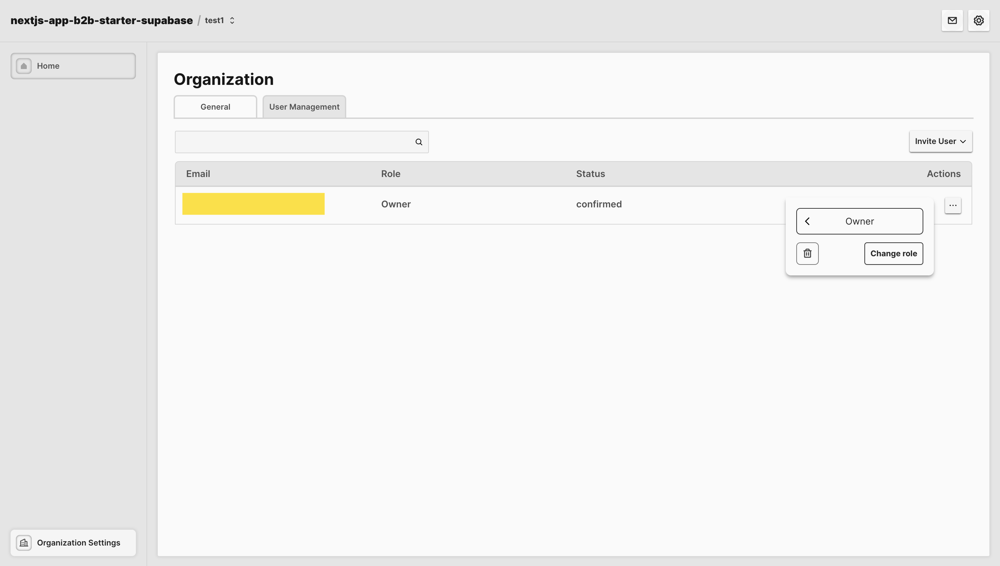

# ⚡️ pixelmothman/nextjs-app-b2b-starter-supabase

This template provides a starting point for building B2B web applications using Next.js, Typescript, Supabase, Zod, TailwindCSS, Radix-ui, React Hot Toast, and Phosphor Icons.

## Powered by

- ◽️ **Next.js**: a React framework for building full-stack web applications.
- 🪖 **Typescript**: javascript with syntax for types.
- 💾 **Supabase**: an open source platform that allows users to build production-grade applications with a Postgres database, Authentication, instant APIs, Realtime, Functions, Storage, and Vector embeddings.
- ✨ **Zod**: TypeScript-first schema validation with static type inference.
- 🧪 **TailwindCSS**: a utility-first CSS framework packed with classes that can be composed to build any design, directly in the markup.
- 🏗️ **Radix-ui Primitives**: An open-source UI component library for building high-quality, accessible design systems and web apps.
- 🔥 **React Hot Toast**: smoking hot React notifications.

## Getting Started

### 1. Environment Setup

Clone the repository and create a `.env.local` file in the root directory. Add the following environment variables with your specific values:

```plaintext
NEXT_PUBLIC_SUPABASE_URL=''
NEXT_PUBLIC_SUPABASE_ANON_KEY=''
SUPABASE_SERVICE_KEY=''
```

### 2. Supabase Setup

Create a new Supabase Project.

#### 2.1 Create Tables
Set up the following tables:

- user_table
- org_table
- org_membership_table
- org_to_delete_table

```sql
    -- user table
    -- the created_at should come from the auth.users table
    create table user_table (
    user_id uuid references auth.users on delete cascade not null primary key,
    user_email text not null,
    user_name text,
    user_email_status text default 'pending' not null,
    updated_at timestamp with time zone,
    created_at timestamp with time zone
    );
    alter table user_table enable row level security;

    -- org table
    create table org_table (
    org_id uuid default gen_random_uuid () not null primary key,
    org_name text not null,
    org_users int4 default 1 not null,
    org_user_exclusivity boolean not null default true,
    updated_at timestamp with time zone,
    created_at timestamp with time zone default now() not null
    );
    alter table org_table enable row level security;

    -- org membership table
    create table org_membership_table(
    org_membership_id uuid default gen_random_uuid () not null primary key,
    org_id uuid references public.org_table (org_id) on delete cascade not null,
    user_id uuid references public.user_table (user_id) not null,
    org_membership_role text not null default 'owner',
    org_membership_status text not null default 'pending',
    invited_by uuid references public.user_table (user_id) null,
    created_at timestamp with time zone default now() not null
    );
    alter table org_membership_table enable row level security;

    -- org to delete table
    create table org_to_delete_table (
        org_to_delete_id uuid not null default gen_random_uuid () primary key,
        org_id uuid references public.org_table (org_id) on delete cascade not null,
        triggered_by uuid references public.user_table (user_id) not null,
        created_at timestamp with time zone not null default now()
    );
    alter table org_to_delete_table enable row level security;
```

#### 2.2 Create Triggers
Create the triggers to:

- Create a profile entry when a new user signs up via Supabase Auth.
- Automatically update a profile entry when a user confirms for the first time their email.
- Automatically update a profile entry when a user updates their email up via Supabase Auth.

```sql
    -- This trigger automatically creates a profile entry when a new user signs up via Supabase Auth.
    create or replace function public.handle_new_user()
    returns trigger as $$
    begin
        insert into public.user_table (user_id, user_email, created_at, user_email_status)
        values (new.id, new.email, new.created_at,
        CASE
            WHEN new.confirmed_at IS NULL THEN 'pending'
        END);
        return new;
    end;
    $$ language plpgsql security definer;
    
    create or replace trigger on_auth_user_created
    after insert on auth.users
    for each row execute procedure public.handle_new_user();


    -- This trigger automatically updates a profile entry when a user confirms for the first time their email.
    create or replace function public.handle_user_confirmed_email()
    returns trigger as $$
    begin
        IF NEW.confirmed_at IS NOT NULL THEN
            UPDATE public.user_table
            SET user_email_status = 'confirmed'
            WHERE user_id = NEW.id;
            UPDATE public.org_membership_table
            SET org_membership_status = 'confirmed'
            WHERE user_id = NEW.id;
        END IF;
        RETURN NEW;
    end;
    $$ language plpgsql security definer;

    create or replace trigger on_auth_user_confirmed_email
    after update of confirmed_at on auth.users
    for each row execute procedure public.handle_user_confirmed_email();

    -- This trigger automatically updates a profile entry when a user updates their email up via Supabase Auth.
    create or replace function public.handle_user_new_email() 
    returns trigger as $$
    BEGIN
        UPDATE public.user_table
        SET user_email = NEW.email
        WHERE user_id = NEW.id;
        RETURN NEW;
    END;
    $$ language plpgsql security definer;

    create trigger on_auth_user_email_updated
    after update of email on auth.users 
    for each row execute procedure public.handle_user_new_email();
```

## Disclaimer

The instructions and guidelines provided in this document reflect the author's opinions and are offered for informational purposes only. Users should exercise their judgment in applying any practices described here.